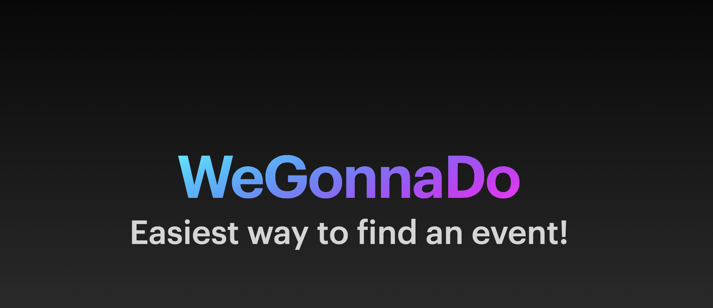
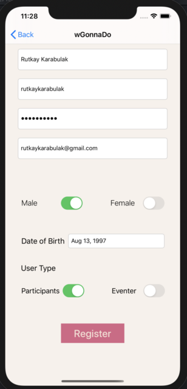
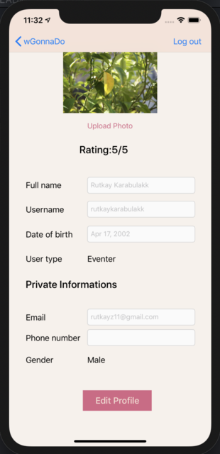
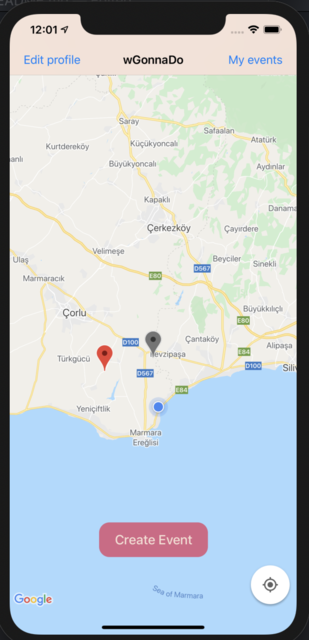
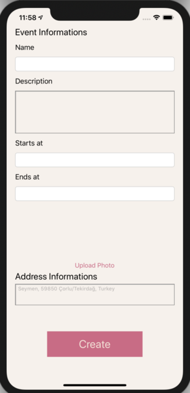
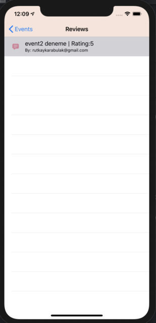
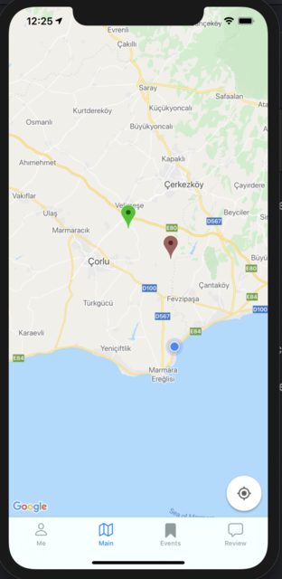
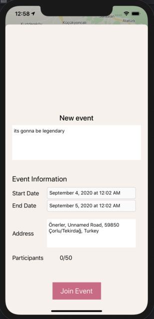

# weGonnaDo

YZM 4101 - Rutkay Karabulak bachelor thesis.

'weGonnaDo' is a mobile application which allows you to see events like hiking, cycling tour, fishing etc. that near you. App is based on iOS mobile platform and it requires iOS 13.0.0 version.
It takes it's power from Google Maps API and one of the useful noSQL database Firebase.

How it works?
- There are 2 type of user, one is ' Eventer ' who has capability to create an event, and other one is ' Participant' who can join and see other events.
- They can register via register interface.

#Figure 1.1

- Both users can edit their profile, changing their name, phone number and more and more.

#figure 1.2

Eventer
-> To create an event, eventer needs pick a location from a map afterwards app will move you to ' Event Creation ' interface, in that page you can adjust every option like start date, end date, description, photo related to event.

*Note: App takes event's address automatically via Google Maps Geocoding ( When the user taps the map it converts that location to human readable address)

figure 1.3

-> When the eventer create an event, it can be seen in map with grey picker icon.
-> Red picker icon represent a location for event to be created.

figure 1.4

-> Eventer can see active event's on a list and in that list he can cancel an event.
-> Eventer also can see reviews that belong to his events in a list, reviews contain rating, comment and author(owner of comment).

figureReview

Participant
-> Participant can edit their profile as same as eventer. (You can check figure 1.2)

-> Participants are able to see active events near them by map via brown icon. When click them, event detail interface will show up afterwards if they decide they can join to the events. Once they join it event icon turns to Green to represent their attendance.

 

figure 1.5 and figure 1.6

-> Participants can see event that they joined in a list and they can de-enroll themselves in that menu.
-> As same as ' Eventer ' participants can see their comment to events that they attended.

Logic:
App is created in MVC pattern. 
To use the app, you have to activate your account via your registered e-mail. This functionality is created by using Firebase Authentication ' Email Verification System '
To avoid a syntax typo during devoloping, a constant struct was created which allows you to store your common strings into a file after whenever you need that string you can create an instance of that struct and you can use it in your file.(You can see this 'Constants' file in project folder.)
Delegate pattern was used most part of app like controlling text fields, invoke map to reload itself etc.
To store event and user images Firebase Storage API was used.

Pod list:
'Firebase/Auth'
'Firebase/Firestore'
'GoogleMaps'
'GooglePlaces'
'Firebase/Storage'
'FirebaseUI/Storage'
